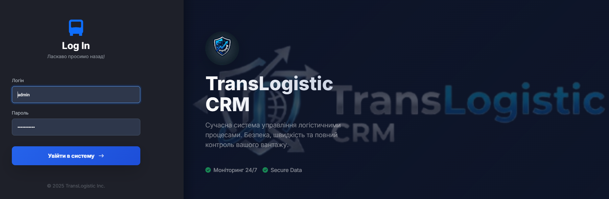

# 🚛 TransLogistic CRM (Secure Edition)

**TransLogistic CRM** — це сучасна веб-система для управління логістичними процесами, розроблена з акцентом на безпеку даних та зручність інтерфейсу (UI/UX). Система дозволяє менеджерам обробляти замовлення, відстежувати статистику та керувати клієнтською базою.


---

## 🛡️ Реалізовані заходи безпеки (Security)

Проект розроблено з урахуванням вимог до безпеки веб-застосунків (OWASP):

1.  **Захист від SQL Injection:**
    * Усі запити до бази даних виконуються через **Prepared Statements** (підготовлені вирази) з використанням `bind_param`.
2.  **Захист від XSS (Cross-Site Scripting):**
    * Вхідні дані очищуються спеціальною функцією `clean()`, яка використовує `htmlspecialchars()` для екранування небезпечних символів.
3.  **Захист від CSRF (Cross-Site Request Forgery):**
    * Впроваджено систему **CSRF-токенів**. Кожна форма (включаючи дії видалення та зміни статусу) захищена унікальним токеном сесії.
4.  **Безпечна автентифікація:**
    * Паролі зберігаються у вигляді хешів (алгоритм `BCRYPT`). Перевірка здійснюється через `password_verify()`.
5.  **HTTPS Enforcement:**
    * Реалізовано програмне перенаправлення на захищений протокол HTTPS (з виключенням для `localhost`).

---

## 🚀 Основний функціонал

* **Сучасний Dashboard:** Темна тема, адаптивний дизайн, Glassmorphism ефекти.
* **Статистика:** Візуалізація даних за допомогою діаграм (Chart.js).
* **Управління замовленнями (CRUD):**
    * Створення нових заявок.
    * Швидка зміна статусів (Нове → В роботі → Готово).
    * Видалення записів.
* **Експорт даних:** Можливість завантажити реєстр у форматі `.csv` (Excel).
* **Зручний UI:** Аватарки клієнтів (ініціали), кольорові бейджі статусів, інтуїтивні іконки.

---

## 📷 Скріншоти

### 🔐 Сторінка входу (Secure Login)

*(Замініть це посилання на реальний скріншот вашої сторінки входу)*

### 📊 Головна панель (Dashboard)
Система відображає ключові метрики та дозволяє керувати процесами в реальному часі.


---

## ⚙️ Встановлення та запуск

1.  **Клонування репозиторію:**
    ```bash
    git clone [https://github.com/Lutvunenko-Dmutro/trans-logistic-crm.git](https://github.com/Lutvunenko-Dmutro/trans-logistic-crm.git)
    ```
2.  **Налаштування бази даних:**
    * Створіть базу даних `transport_db` у phpMyAdmin.
    * Імпортуйте файл `database.sql` (або виконайте SQL-запити для створення таблиць `users` та `orders`).
3.  **Конфігурація:**
    * Перевірте налаштування підключення у файлі `db.php` (за замовчуванням: `root`, без пароля).
4.  **Запуск:**
    * Відкрийте проект через локальний сервер (наприклад, XAMPP): `http://localhost/trans-logistic-crm`.

### 🔑 Доступ (Адміністратор)
* **Логін:** `admin`
* **Пароль:** `password123` *(або той, який ви задали при створенні хешу)*

---
## 📂 Структура проекту

```text
trans-logistic-crm/
├── screenshots/          # Папка зі скріншотами для документації
│   ├── login-page.png
│   └── dashboard.png
│
├── api.php               # API-ендпоінт: повертає дані у форматі JSON (Завдання 4.2)
├── db.php                # Конфігурація підключення до MySQL (mysqli)
├── functions.php         # Допоміжні функції: clean() для XSS-захисту, валідація
├── process.php           # Контролер: обробка POST-запитів (Login, Logout, CRUD, Export)
│
├── index.php             # Головна сторінка (Dashboard). Реалізовано HTTP-кешування (Завдання 5.2)
├── login.php             # Сторінка входу. Реалізовано Lazy Loading та HTTPS (Завдання 5.3)
│
├── style.css             # Стилізація (Dark Mode, адаптивність)
├── script.js             # JS: логіка графіків (Chart.js), перемикання теми, AJAX
├── login-bg.jpg          # Фонове зображення (оптимізоване)
│
├── database.sql          # SQL-дамп: структура таблиць `users`, `orders` та демо-дані
└── README.md             # Документація проекту
```
## 👨‍💻 Автор

**Литвиненко Дмитро**
* Студент групи I-23
* Спеціальність: Інженерія програмного забезпечення
* ЗВО «МНТУ»

---
*Project created for Educational Purposes (Practical Work #6)*


