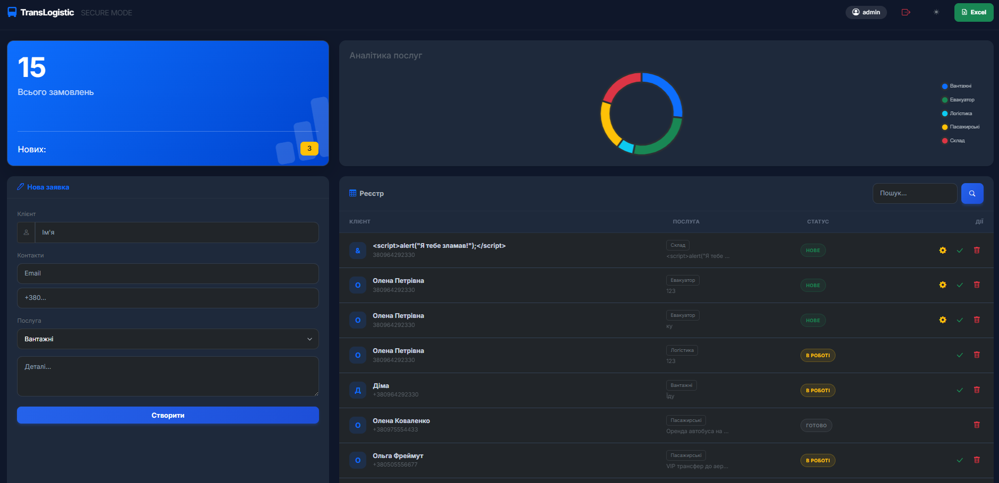

# 🚛 ransLogistic CRM v4.0 (Dark Mode Edition)

**TransLogistic CRM** — це сучасна система управління взаємовідносинами з клієнтами (CRM), розроблена спеціально для логістичних та транспортних компаній. 

Веб-застосунок дозволяє автоматизувати процес приймання заявок, відстежувати ефективність роботи менеджерів та вести облік замовлень у реальному часі.


*(Інтерфейс системи: Панель керування в темній темі)*

---

## 🔥 Ключові можливості

### 1. Інформаційна панель (Dashboard)
* **KPI Моніторинг:** Відображення загальної кількості замовлень та лічильник нових заявок (Badge Counter) у реальному часі.
* **Візуальна аналітика:** Інтегровано бібліотеку **Chart.js** для побудови діаграми (Doughnut Chart), що демонструє розподіл замовлень за типами послуг (Вантажні, Пасажирські, Евакуатор, Склад).

### 2. Керування замовленнями (CRUD)
* **Створення заявок:** Зручна форма з валідацією даних на стороні сервера (Server-Side Validation).
* **Реєстр:** Табличне відображення бази даних із сортуванням за датою.
* **Пошук:** "Живий" пошук по клієнтах та номерах телефонів.
* **Зміна статусів:** Швидкі дії для переведення замовлення в статус "В роботі" (⚙️) або "Виконано" (✅).
* **Видалення:** Безпечне видалення записів із підтвердженням.

### 3. Інтерфейс та UX
* **Dark/Light Mode:** Повноцінна підтримка темної теми (на базі **Bootstrap 5.3**). Вибір користувача зберігається в `localStorage` браузера.
* **Адаптивність:** Інтерфейс повністю адаптований під мобільні пристрої, планшети та десктопи.
* **Інтерактивність:** Плавні анімації, спливаючі повідомлення, індикатори завантаження.

### 4. Додаткові інструменти
* **Експорт даних:** Можливість вивантаження повної бази замовлень у форматі **.CSV (Excel)**.
* **Друк:** Оптимізована версія сторінки для друку звітів (приховує навігацію та кнопки).
* **Валідація:** Перевірка формату українських номерів (`+380...`) та існування домену пошти (DNS Check).

---

## 🛠 Технологічний стек

* **Backend:** PHP 8.2 (Нативний, без фреймворків).
* **Database:** MySQL / MariaDB.
* **Frontend:** HTML5, CSS3, JavaScript (ES6).
* **UI Framework:** Bootstrap 5.3 (Dark Mode Support).
* **Libraries:**
  * `Chart.js` — для графіків.
  * `Bootstrap Icons` — для іконок інтерфейсу.

---

## 🚀 Інструкція із запуску (Detailed Guide)

Якщо ви повернулися до цього проєкту через довгий час або хочете розгорнути його на новому комп'ютері, виконайте наступні кроки.

### 📋 Крок 0. Підготовка середовища
Для роботи проєкту потрібен локальний сервер, який підтримує **PHP** та **MySQL**.
1.  Завантажте та встановіть **XAMPP** (або OpenServer / MAMP).
2.  Відкрийте панель керування (XAMPP Control Panel).
3.  Натисніть **Start** навпроти модулів:
    * **Apache** (Веб-сервер)
    * **MySQL** (База даних)

### 📂 Крок 1. Встановлення файлів
1.  Зайдіть у папку серверу:
    * Для XAMPP: `C:\xampp\htdocs\`
    * Для OpenServer: `C:\OpenServer\domains\`
2.  Створіть там папку для проєкту, наприклад: `trans-logistic`.
3.  Скопіюйте в цю папку всі файли з цього репозиторію (`index.php`, `db.php`, `database.sql`, тощо).

### 🗄️ Крок 2. Відновлення Бази Даних
Без цього кроку сайт покаже помилку підключення.
1.  Відкрийте у браузері **phpMyAdmin**: `http://localhost/phpmyadmin`
2.  Створіть нову базу даних:
    * Ім'я: **`transport_db`** (важливо!)
    * Кодування: `utf8mb4_general_ci`
3.  Натисніть кнопку **Create**.
4.  Виберіть створену базу зліва, перейдіть у вкладку **Import** (Імпорт).
5.  Виберіть файл **`database.sql`** (він є в цьому репозиторії) і натисніть **Go** (Вперед).
    * *Альтернатива:* Відкрийте файл `database.sql` у блокноті, скопіюйте код і вставте його у вкладку **SQL** в phpMyAdmin.

### ⚙️ Крок 3. Налаштування конфігурації
Відкрийте файл `db.php` і переконайтеся, що налаштування відповідають вашому серверу.
Стандартні налаштування для XAMPP:

```php
$servername = "localhost";
$username = "root";      // Стандартний логін XAMPP
$password = "";          // Стандартний пароль порожній
$dbname = "transport_db"; // Має співпадати з ім'ям у Кроці 2
````

### 🚀 Крок 4. Запуск

Відкрийте браузер і перейдіть за адресою:
`http://localhost/trans-logistic`
*(замініть `trans-logistic` на назву папки, яку ви створили у Кроці 1)*

-----

## 👨‍💻 Автор

Проєкт виконав студент групи I-23
**Литвиненко Дмитро**

-----

*Developed for educational purposes as part of Practical Work regarding PHP & MySQL integration.*


