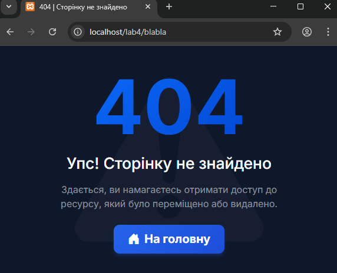

# 🚛 TransLogistic CRM (Secure Edition)


**TransLogistic CRM** — це захищена веб-система для автоматизації логістичних процесів. Проект розроблено в рамках навчального курсу з акцентом на **кібербезпеку**, **оптимізацію продуктивності** та **REST API**.

Система дозволяє менеджерам безпечно обробляти замовлення, керувати клієнтською базою та отримувати аналітику в реальному часі.

---

## 🛡️ Реалізовані заходи безпеки (Security)

Проект відповідає основним вимогам **OWASP** щодо захисту веб-застосунків:

- ✅ **SQL Injection Prevention:**
  Взаємодія з базою даних реалізована виключно через **Prepared Statements** (підготовлені вирази) драйвера `mysqli`.
- ✅ **XSS Protection (Cross-Site Scripting):**
  Всі вхідні та вихідні дані проходять санітизацію через кастомну функцію `clean()`, що екранує HTML-сутності.
- ✅ **CSRF Protection:**
  Впроваджено валідацію **anti-CSRF токенів** для всіх форм (POST-запитів) та дій, що змінюють стан системи.
- ✅ **Secure Authentication:**
  Паролі користувачів хешуються за допомогою алгоритму `BCRYPT` (`password_hash`).
- ✅ **HTTPS Enforcement:**
  Реалізовано програмний редірект на захищений протокол HTTPS (для production-середовища).

---

## 🚀 Функціональні можливості

### 🎨 Інтерфейс (Frontend)
- **Сучасний Dashboard:** Темна тема (Dark Mode), адаптивна верстка на Bootstrap 5.
- **Візуалізація:** Інтерактивні графіки статистики (Chart.js).
- **UX/UI:** Анімовані елементи, Glassmorphism, індикатори завантаження (Lazy Loading).
- **Error Handling:** Кастомна сторінка **404 Not Found**, стилізована під загальний дизайн системи.

### ⚙️ Логіка (Backend)
- **CRUD Операції:** Створення, читання, оновлення та видалення заявок.
- **REST API:** Ендпоінт `api.php` для експорту даних у форматі JSON (підтримка фільтрації).
- **Експорт:** Генерація звітів у форматі CSV (Excel).
- **Кешування:** Реалізовано заголовки HTTP-кешування (`ETag`, `Cache-Control`) для оптимізації трафіку.

---

## 📂 Структура проекту

```text
trans-logistic-crm/
├── screenshots/          # Скріншоти інтерфейсу
│   ├── login.png
│   ├── dashboard.png
│   └── 404.png
│
├── api.php               # REST API endpoint (JSON Export) [Завдання 4.2]
├── db.php                # Конфігурація підключення до БД (Singleton/Wrapper)
├── functions.php         # Хелпери: clean(), валідація даних
├── process.php           # Контролер: обробка POST-запитів, CSRF-захист
│
├── index.php             # Головна панель. HTTP-кешування [Завдання 5.2]
├── login.php             # Авторизація. Lazy Loading логотипу [Завдання 5.3]
├── 404.php               # Кастомна сторінка помилки [Покращення UX]
│
├── style.css             # Стилі (Custom Dark Theme)
├── script.js             # Клієнтська логіка (Chart.js, AJAX)
├── Avatar.png            # Графічні ресурси
│
├── database.sql          # Дамп бази даних (структура + демо-дані)
├── .htaccess             # Налаштування Apache (Error 404, HTTPS)
└── README.md             # Документація

```

---

## 📷 Скріншоти інтерфейсу

### 🔐 Сторінка входу

*Лаконічний дизайн із захищеною формою авторизації.*

### 📊 Головна панель (Dashboard)

*Відображення статистики та таблиці замовлень з можливістю керування статусами*

### ⚠️ Сторінка 404



*Кастомна обробка помилок навігації.*

---
## ⚙️ Інструкція зі встановлення

1. **Клонування репозиторію:**
```bash
git clone https://github.com/Lutvunenko-Dmutro/trans-logistic-crm.git
```


2. **Налаштування бази даних:**
* Створіть базу даних з ім'ям `transport_db`.
* Імпортуйте файл `database.sql` через phpMyAdmin або консоль.


3. **Конфігурація підключення:**
* Відкрийте файл `db.php`.
* За необхідності змініть налаштування `$servername`, `$username`, `$password`.


4. **Запуск:**
* Розмістіть папку проекту на локальному сервері (XAMPP/OpenServer).
* Відкрийте в браузері: `http://localhost/trans-logistic-crm`


### 🔑 Тестовий доступ (Admin)

* **Login:** `admin`
* **Password:** `password123`

---

## 👨‍💻 Автор

**Литвиненко Дмитро**

* Студент групи: **I-23**
* Спеціальність: **Інженерія програмного забезпечення**
* Заклад: **ЗВО «МНТУ»**

---

*Project created for Educational Purposes (Practical Work #6)*
